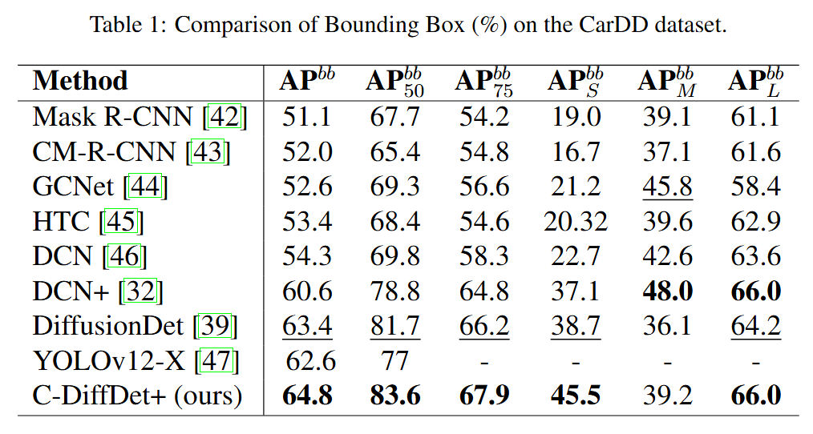

# Official Implementation of **C-DiffDet+: Fusing Global Scene Context with Generative Denoising for High-Fidelity Car Damage Detection**

This repository provides the PyTorch implementation of **C-DiffDet+**, a diffusion-based object detection framework that integrates **global scene context** with **generative denoising**. The project includes scripts for **training, evaluation, visualization, and inference**, and is designed for easy experimentation and reproducibility.

---

## 📂 Repository Structure

```bash
c_diffdet_plus
│
├── configs/ # Configuration files
├── diffusiondet/ # Core model implementation
├── demo.py # Inference / demo script
├── train_net.py # Training script
├── LICENSE # MIT License
└── README.md
```

---

## ⚙️ Installation

### 1. Clone the repository

```bash
git clone https://github.com/ilyesbenaissa/c_diffdet_plus.git
cd c_diffdet_plus
```
### 2. Create a virtual environment
Using conda:
```bash
conda create -n cdiffdet python=3.9
conda activate cdiffdet
```
### 2. Prepare dataset

The framework supports training on datasets in COCO format. Prepare your dataset and update paths inside the configuration files.
Download [CarDD Dataset](https://cardd-ustc.github.io/)

### 3. Install dependencies
   
```bash
pip install torch torchvision
pip install numpy opencv-python tqdm
pip install 'git+https://github.com/facebookresearch/detectron2.git'
```
💡If the installation fails due to build isolation issues, install it using:
```bash
pip install --no-build-isolation 'git+https://github.com/facebookresearch/detectron2.git'
```
Download pretrained model:
[swin_base_patch4_window7_224_22k](https://github.com/ShoufaChen/DiffusionDet/releases/download/v0.1/swin_base_patch4_window7_224_22k.pkl)

### Training
To train the model:

```bash
python train_net.py --config configs/diffdet.coco.swinbase.yaml
```

### Inference
Run inference on an image:

```bash
python demo.py --input path/to/image.jpg
```
The script will output detected objects with bounding boxes and confidence scores.


### Test/Evaluation
Run evaluation using:
```bash
python train_net.py --eval-only --config configs/test_swinB_carDD.yaml.yaml
```

### Results


---
## 📝 Citation
If you use this code in your research, please cite:

```bibtex
@misc{sellam2025cdiffdetplus,
  title={C-DiffDet+: Fusing Global Scene Context with Generative Denoising for High-Fidelity Car Damage Detection},
  author={Sellam, Abdellah Zakaria and Benaissa, Ilyes and Bekhouche, Salah Eddine and Hadid, Abdenour and Renó, Vito and Distante, Cosimo},
  year={2025},
  eprint={2509.00578},
  archivePrefix={arXiv},
  primaryClass={cs.CV},
  url={https://arxiv.org/abs/2509.00578}
}
```

---
## 👨‍💻 Contact:

For any questions related to this project, feel free to open issue, or contact: ilyesbenaissa7429@gmail.com , abdellahzakaria.sellam@unisalento.it

---
## 📜 License:

This project is licensed under the MIT License.

---
## ⭐ Support
If you find this repository useful, please consider giving it a star ⭐.


---
## 🙏 Acknowledgments

This project builds upon several outstanding open-source projects. We sincerely thank the authors and contributors of the following repositories:

- **Detectron2**  
  https://github.com/facebookresearch/detectron2  

- **Sparse R-CNN**  
  https://github.com/PeizeSun/SparseR-CNN  

- **denoising-diffusion-pytorch**  
  https://github.com/lucidrains/denoising-diffusion-pytorch  

- **DiffusionDet**  
  https://github.com/ShoufaChen/DiffusionDet  

